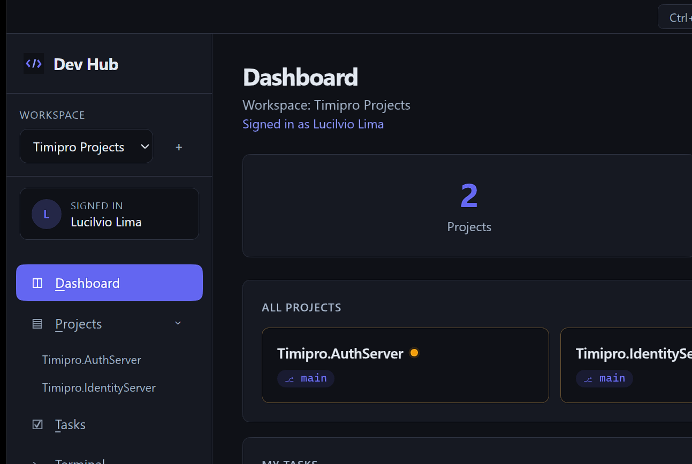
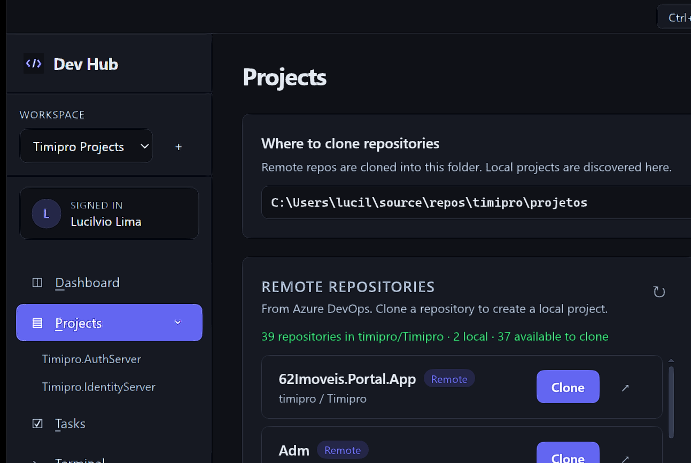

# Dev Hub

<p align="center">
  
</p>

<p align="center">
  <strong>Your Azure DevOps projects, in one desktop hub.</strong><br>
  Clone repos, open them in your IDE, track tasks and pull requests, and run terminals — without jumping between browser tabs.
</p>

<p align="center">
  
</p>

---

## What it is

**Dev Hub** is a Windows Electron app for developers who live in Azure DevOps.

Instead of switching between the Azure portal, File Explorer, Visual Studio / VS Code, and a terminal, you get one place to:

- See all local projects in a workspace
- Clone remote Azure DevOps repositories with progress
- Open a project in **VS Code** or **Visual Studio**
- Review assigned tasks and pull requests awaiting review
- Run an integrated terminal in the project folder
- Keep separate workspaces (for example work vs personal)

---

## Features

| Area | What you get |
| --- | --- |
| **Workspaces** | Separate clone folders, Azure connections, and quick links per context |
| **Projects** | Browse remote Azure repos, clone locally, open / delete local projects |
| **Project detail** | Branch switch, pull, recent commits, PRs awaiting review, README, git history report |
| **Tasks** | Work items assigned to you from Azure Boards |
| **Terminal** | Built-in multi-tab terminal (`node-pty`) |
| **Command bar** | Quick jump to projects and actions with `Ctrl+Q` |
| **Quick links** | Pin frequently used URLs on the dashboard |

<p align="center">
  
</p>

---

## Requirements

- **Windows** 10/11
- **Node.js** 18+ (LTS recommended)
- **Git** on `PATH`
- An **Azure DevOps** organization with a Personal Access Token (PAT)

Optional:

- [Visual Studio Code](https://code.visualstudio.com/)
- [Visual Studio](https://visualstudio.microsoft.com/) (for the **VS** button)

---

## Install & run

```bash
git clone https://github.com/lucilvio/dev-hub.git
cd dev-hub
npm install
npm start
```

For slightly more verbose Electron logging:

```bash
npm run dev
```

---

## First-time setup

1. Open **Settings** (`Alt+S`).
2. Set a **clone location** — the folder where repos are cloned and local projects are discovered.
3. Fill in **Azure DevOps**:
   - Organization (for example `my-org`)
   - Project (for example `MyProject`)
   - Personal Access Token
4. Click **Test Connection**, then **Save Settings**.

### PAT scopes

Create a PAT in Azure DevOps → **User settings → Personal access tokens** with at least:

- **Code** — Read (clone / list repositories)
- **Work Items** — Read (tasks)
- **Identity** — Read (signed-in user)

Grant **Code — Read & write** only if you need operations beyond read/clone in your environment.

---

## How to use

### Dashboard

Overview of the current workspace: project count, project cards, assigned tasks, and quick links.

### Projects

- **Remote repositories** — list from Azure DevOps; click **Clone** to create a local project
- **Local projects** — open the project page, open the folder, or delete the local copy (remote stays intact)

### Project page

From a local project you can:

- Pull / switch branch
- Open in **VS Code** or **Visual Studio**
- Jump to Azure DevOps
- See commits, branches, and PRs awaiting review
- Generate a git history report

### Tasks

Shows open Azure Boards work items assigned to you (`@Me`).

### Terminal

Multi-tab shell rooted in your clone folder or a selected project.

### Workspaces

Use the sidebar switcher to create isolated environments. Each workspace keeps its own clone path, Azure settings, and links.

---

## Keyboard shortcuts

| Shortcut | Action |
| --- | --- |
| `Ctrl+Q` | Focus the command bar |
| `Alt+D` | Dashboard |
| `Alt+P` | Projects |
| `Alt+T` | Tasks |
| `Alt+E` | Terminal |
| `Alt+S` | Settings |

---

## Tech stack

- [Electron](https://www.electronjs.org/)
- Plain HTML / CSS / JavaScript (no frontend framework)
- [electron-store](https://github.com/sindresorhus/electron-store) for settings
- [node-pty](https://github.com/microsoft/node-pty) + [xterm.js](https://xtermjs.org/) for the terminal
- Azure DevOps REST APIs

---

## Project layout

```
dev-hub/
├── electron/          # Main process, IPC, Git & Azure integration
├── src/               # Renderer UI (HTML, CSS, JS)
├── assets/            # App icon
└── docs/screenshots/  # README images
```

---

## Contributing

Issues and pull requests are welcome. Keep changes focused and match the existing style in `electron/` and `src/`.

---

## License

[MIT](LICENSE)
